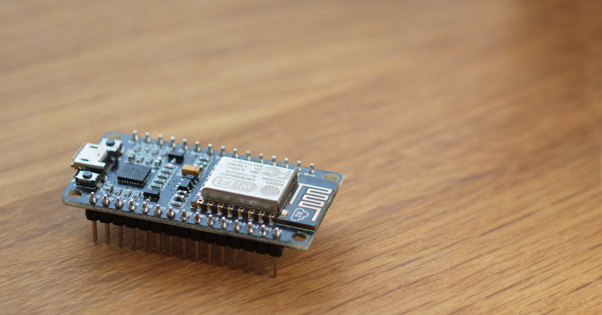
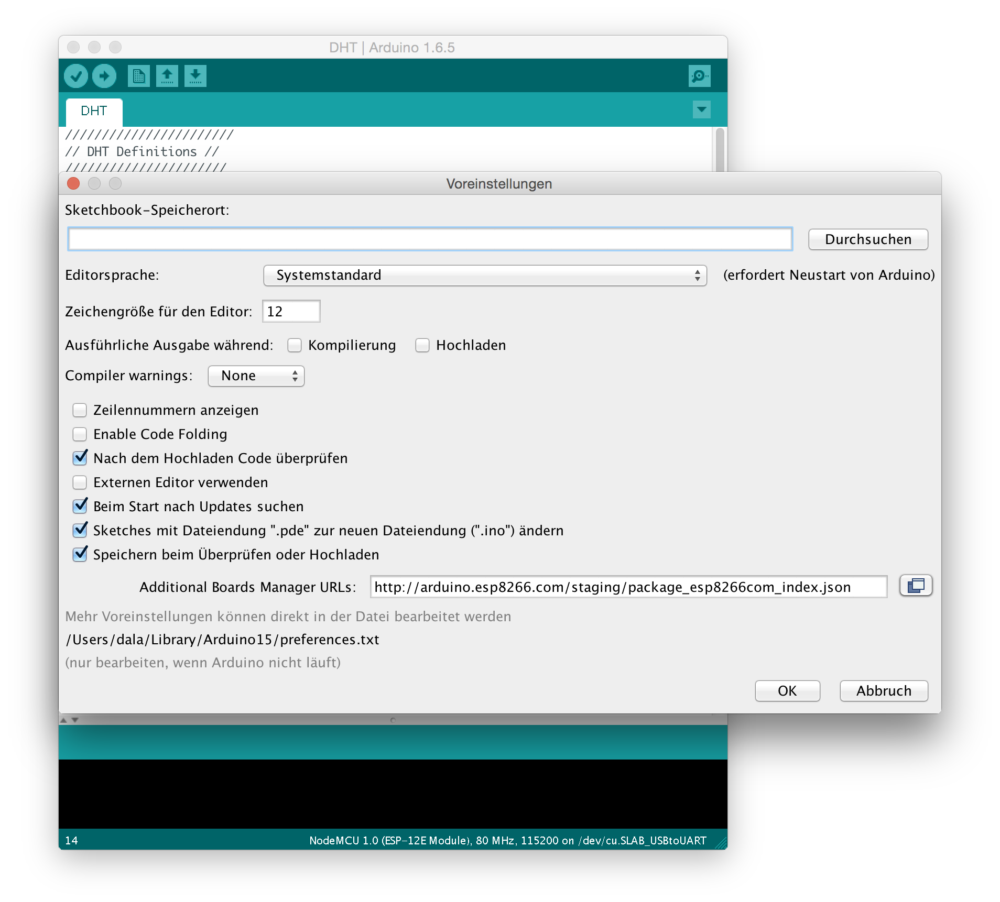
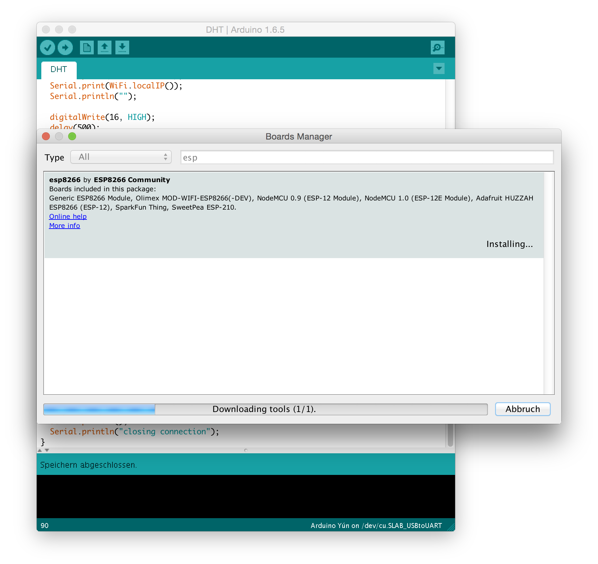
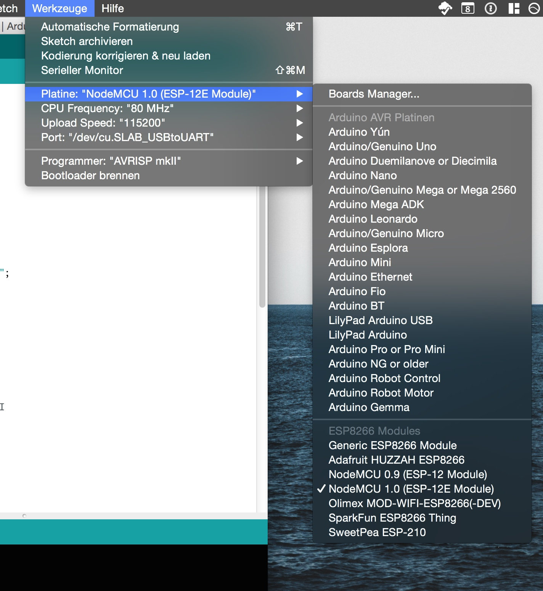
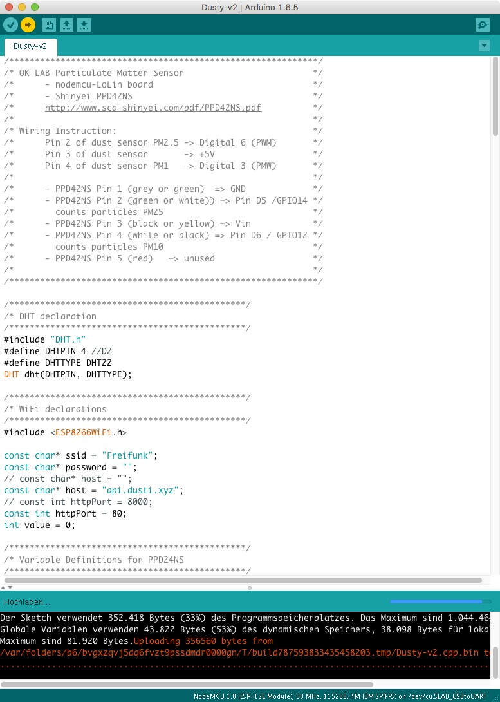

# Beginner's Guide

Anstelle den ESP8266 oder NodeMCU mit dem Terminal zu programmieren, kann die Arduino IDE genutzt werden. In dieser Anleitung werden die Schritte gezeigt, um die Arduino IDE für den ESP8266 vorzubereiten.

## Identifizieren des NodeMCUs
NodeMCU umdrehen und schauen, ob `CP2102` oder `CH340G` Treiber installiert müssen.
Nur für Windows und Mac, Linux hat bereits die Treiber installiert.
[comment]: # "CP2102 und CH340G sind jeweils UART zu USB Transciever"

#### NodeMCU v2
CP210x USB TO UART Bridge Treiber

* [Treiber für Mac / Win](https://www.silabs.com/products/mcu/Pages/USBtoUARTBridgeVCPDrivers.aspx)

#### NodeMCU v3
CH340G Bridge Treiber

* [Treiber für Mac](http://www.wch.cn/download/CH341SER_MAC_ZIP.html)
* [Treiber für Windows](http://www.arduined.eu/files/CH341SER.zip)

Nach der Installation der Treiber Rechner neustarten.

Bemerkung für MacOS 10.9 oder neuer: Wenn ein nicht-signierter Treiber installiert wird, muss dies in MacOS explizit erlaubt werden. Eine gute Beschreibung gibt es bei [tzapu.com](https://tzapu.com/making-ch340-ch341-serial-adapters-work-under-el-capitan-os-x/)

## Board Manager installieren
Die [Arduino IDE](https://www.arduino.cc/en/Main/Software) herunterladen & installieren.

In den Einstellungen (**Datei** → **Voreinstellungen** in das **Additional Board Manager URLs** Feld diese URL einfügen: `http://arduino.esp8266.com/stable/package_esp8266com_index.json`



In **Werkzeuge** → **Platine** → **Boardmanager** nach dem ESP8266 Paket suchen und installieren.



## ESP8266 / NodeMCU Einstellungen
Nach dem Neustart der Arduino IDE in **Werkzeuge** → **Platine** das entsprechende Board auswählen

- NodeMCU 0.9 (ESP-12 Module) **für NodeMCU v1**
- NodeMCU 1.0 (ESP-12E Module) **für NodeMCU v2 und v3**



## Port auswählen
Port auswählen **Werkzeuge** → **Port**.

* MAC: Beim `CP2102` wäre das auf dem Mac der **/dev/cu.SLAB_USBTOUART**, für den `CH340G` ist es der Port **/dev/cu.wchusbserialXXXXXXXX**.
* Windows: Windows COM3. Wenn dies nicht der richtige ist, dann einfach den nächsten in der Liste auswählen.
* Linux: /dev/ttyUSB0

## Code auf den NodeMCU überspielen
### Quelltext laden
Den [Quelltext][] bekommt man am einfachsten, in dem man das [Repository][] klont. Alternativ kann man das [Repository als Archiv][] oder alle Dateien aus dem [Quelltext][] Verzeichnis einzeln kopieren.
*Tipp: um den Code von einzelnen Dateien über das GitHub-Webinterface besser zu kopieren jeweils auf den **RAW** Button klicken*

Als nächstes das sogenannte Sketch (`INO`-Datei) in der Arduino IDE öffnen.

[Quelltext]: https://github.com/opendata-stuttgart/sensors-software/tree/master/airrohr-firmware
[Repository]: https://github.com/opendata-stuttgart/sensors-software/
[Repository als Archiv]: https://github.com/opendata-stuttgart/sensors-software/archive/master.zip

### Wifi einstellen
```lua
// WLAN Konfig
#define WLANSSID "Freifunk-disabled"
#define WLANPWD ""
```

In der Datei `ext_def.h` im Abschnitt **WLAN Konfig** die SSID (Name des WLANs) und das dazugehörige Passwort eintragen.

### NodeMCU flashen
Auf den → oder im Menü **Sketch** → **Hochladen** klicken.



## Überprüfen
**Werkzeuge** → **Serieller Montior** aktivieren, damit man über USB Schnittstelle die aktuellen Daten lokal anschauen kann.

Nun kann überprüfen, ob es an einer Stelle zu Fehlern führt, z.B. NodeMCU kann sich nicht ins Wlan einloggen, kann die Daten nicht hochladen,…


