% Bauanleitung Feinstaubsensor
% luftdaten.info – Feinstaub selber messen

* [Bauanleitung online](https://luftdaten.info/feinstaubsensor-bauen/)

## Feinstaubsensor – Bauanleitung

### Bausatzliste

* NodeMCU ESP8266, CPU/WLAN 
* SDS011 Feinstaubsensor
* Temperatursensor 
    * DHT22, Temperatur & Luftfeuchtigkeit 
    * alternativ BME280 mit zusätzlichem Luftdrucksensor und i²c-Schnittstelle

* Bilderstrecke NodeMCU, SDS011, DHT22, BME280
    
    {width=20%}
    {width=20%}
    {width=10%}
    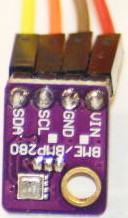{width=10%}
* Steckverbinder (Dupont-Kabel) 2x4 Stück
* USB Kabel z.B: flach 2m Micro-USB
* Steckernetzteil USB
* 2x Kabelbinder (sehr klein/schmal)
* Schlauch, möglichst nicht transparent, Innen-Durchmesser 6 mm, Länge ca. 20cm (Baumarkt)
* Wetterschutz: 2x Marley Silent HT Bogen (DN 75 87°)
* Die Firmware sollte schon eingespielt sein, bitte prüfen, sonst nach Anleitung auf luftdaten.info: [Firmware einspielen](https://luftdaten.info/feinstaubsensor-bauen/#firmware-einspielen), z.B. mit dem [airrohr-firmware-flasher](https://github.com/opendata-stuttgart/airrohr-firmware-flasher)
    * ESP anschließen, dann sollte es nach 1-2 Minuten ein WLAN Feinstaubsensor-xxx WLAN geben
    * oder: via USB an den Rechner anschließen und serielle Schnittstelle beobachten (evtl. Treiber notwendig und serielles Terminal-programm)

## Zusammenbau der Elektronik

Die elektronischen Teile werden zusammen geschaltet

{width=40%}
{width=40%}

**Hinweis:**Unsere Anleitung bezieht sich auf Version 3 der NodeMCU. Diese ist zu erkennen an den Anschlüssen VU und G (siehe Zeichnung). Bei anderen Versionen steht an diesen Anschlüssen RSV. Dort können die Anschlüsse VIN statt VU und GND statt G neben dem MicroUSB-Anschluß genutzt werden. Siehe auch [Pinouts NodeMCU v2, v3](https://github.com/opendata-stuttgart/meta/wiki/Pinouts-NodeMCU-v2,-v3).

### Anschluß SDS011

Pins sind von RECHTS nach LINKS nummeriert, beim Verbinden darauf achten, das die Kabel wirklich auf den Pins stecken, da die meisten Dupont-Kabel auch „neben“ die Pins passen. Falls lange und kurze Kabel da sind, hier die kurzen nutzen.

| SDS011 Pin| Text   | NodeMCU (ESP8266)                       |
|----------:|-------:|:----------------------------------------|
|         1 | TXD    | Pin D1                                  |
|         2 | RXD    | Pin D2                                  |
|         3 | GND    | GND/G                                   |
|         4 | 2,5 um |                                         |
|         5 | 5V     | VU (NodeMCU v3) / VIN (NodeMCU v1,v2)   |
|         6 | 1 um   |                                         |
|         7 | NC     |                                         |

### Anschluß eines DHT22

Pins sind von LINKS nach RECHTS nummeriert, Vorderseite ist das „Gitter“. 

| DHT22 Pin |  NodeMCU (ESP8266) |
|----------:|:-------------------|
|  1 | 3V3 (3.3V)/VU (5V)        |
|  2 | D7                        |
|  3 |                           | 
|  4 | GND/G                     |

<!--
{width=30%}
-->

### Anschluß eines BME280 (Alternative zum DHT22)

Die Pins des BME280 sind beschriftet, es werden 4 Pins verbunden:

| BME280  | NodeMCU (ESP8266) |
|--------:|:------------------|
|     VIN | 3V3 (3.3V)    |
|     GND | GND/G         |
|     SDA | D3            |
|     SCL | D4            |

Andere i²c-Geräte (z.B. Display) werden ebenfalls dieselben Pins SDA-D3 und SCL-D4 angeschlossen (y-Kabelverbindung notwendig). Anschlüsse für einige weitere Bauteile sind online in der [FAQ](https://luftdaten.info/faq/) aufgeführt.

### Zusammenbinden

* Mit dem ersten Kabelbinder den NodeMCU (ESP8266) und den Sensor SDS011 so zusammenbinden, dass die WLAN Antenne vom Sensor weg zeigt 
* Mit dem zweiten Kabelbinder den Temperatursensor DHT22 (alternativ BME280) am Schlauch befestigen 
* USB-Kabel durch das Rohr fädeln. Einbau so, dass die Platine des SDS oben ist und der Lüfter unten 
* auf der Röhrenseite ohne Gummidichtung einschieben 
* Die Teile so in das Rohr schieben, dass der Sensor im Rohr festklemmt 
* Schlauch mit USB Kabel aus dem Rohr Ende schauen lassen 
* Schlauch mit USB Kabel aus dem Rohr Ende schauen lassen.
* Den zweiten Rohrbogen auf den ersten schieben. Dabei darauf achten, dass keine Kabel eingeklemmt werden.
* Den Temperatursensor am Schlauch so positionieren, dass er knapp im Rohrinneren ist
* Den Schlauch am Rohrende abschneiden.
* Die offenen Enden der Rohre mit einem Netz, Gitter oder ähnlichen verschließen, dass die Luft zirkulieren kann aber die Tiere wie Käfer, Spinnen oder ähnliches draußen bleiben.
* Bilderstrecke 

    {width=30%}-->
    {width=30%}
    {width=30%}

## Konfiguration der Messstation

* Station mit Stromkabel anschließen
* Die Station versucht, sich auf den konfigurierten WLAN-Accesspoint zu verbinden (default ist "Freifunk-disabled"). Klappt dies nicht, öffnet der Sensor einen Accesspoint mit dem Namen Feinstaubsensor-ID, wobei ID die ChipID (dezimal, im Beispiel unten die 13597771) ist.  
**Diese ID bitte unbedingt notieren, diese wird für die Anmeldung des Sensors benötigt!**
* Mit diesem Accesspoint verbinden. Kurz warten, bis die Verbindung hergestellt ist.  
**Android:** Falls die Verbindung sofort wieder getrennt wird muss evtl. unter _‚Verbindungen-WLAN-Erweitert‘_ die Option _‚Intelligenter Netzwechsel‘_ (englisch _‚Smart network switch‘_) deaktiviert werden.
* Dann im Browser die Seite http://192.168.4.1/ aufrufen, dort kann der Sensor konfiguriert werden: http://192.168.4.1/ –> Konfigurieren 

    **Bitte beachten:** Es braucht eventuell ein paar Versuche, bis der NodeMCU sich mit dem Heim-WLAN verbindet. Bitte nicht ungeduldig werden und es solange versuchen, bis es klappt. Der Chip kann auch über ein Smartphone konfiguriert werden. Wenn die Konfiguration des Sensors funktioniert hat, ist die Konfigurationsseite unter dieser IP 192.168.4.1 nicht mehr erreichbar 
* Unter ‚Konfigurieren‘ die SSID (Name des Heim-WLANs) und den Netzwerksicherheitsschlüssel (unter Windows) bzw. das WLAN-Passwort des Heim-WLANs eintragen, speichern
* Für Feinstaubsensoren nach dieser Anleitung muss nichts weiter geändert werden
* Nach dem Speichern wird der Sensor neu gestartet und ist auf diesem Weg nicht mehr erreichbar, wenn er sich mit dem WLAN verbindet

Wenn keine weiteren Änderungen vorgenommen worden als das Eintragen der WLAN-Daten, kann der Sensor nach ca. 10 Minuten auf den folgenden Seiten ‚getestet‘ werden. Gesucht werden muss auf diesen Seiten nach der ChipID (im Bespiel oben die 13597771).  
Sensordaten: [www.madavi.de/sensor/graph.php](http://www.madavi.de/sensor/graph.php) 
WLAN-Signal: [www.madavi.de/sensor/signal.php](http://www.madavi.de/sensor/signal.php)

### Screenshots

* Airrohr Startseite, Airrohr Konfiguration: WiFi und Sensoren (hier: BME280), Weitere Einstellungen und APIs

    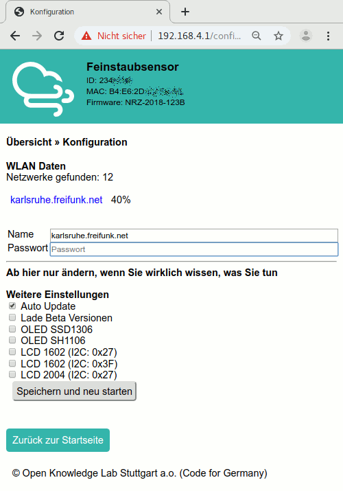{width=24%}
    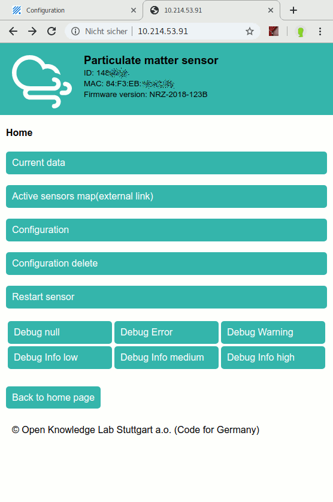{width=24%}
    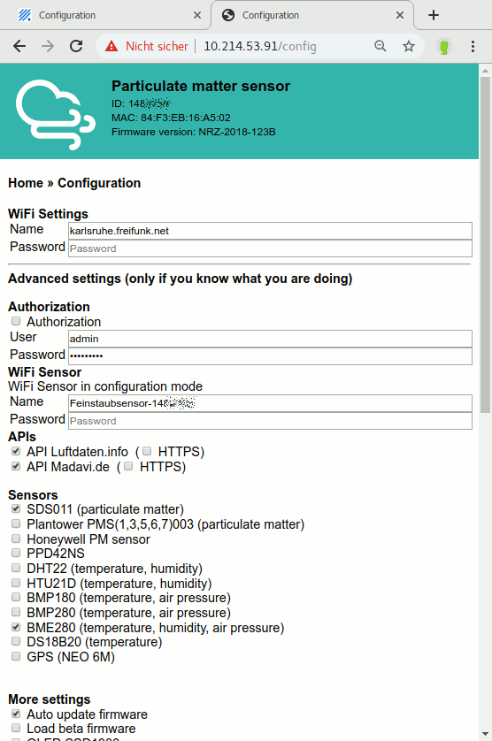{width=24%}
    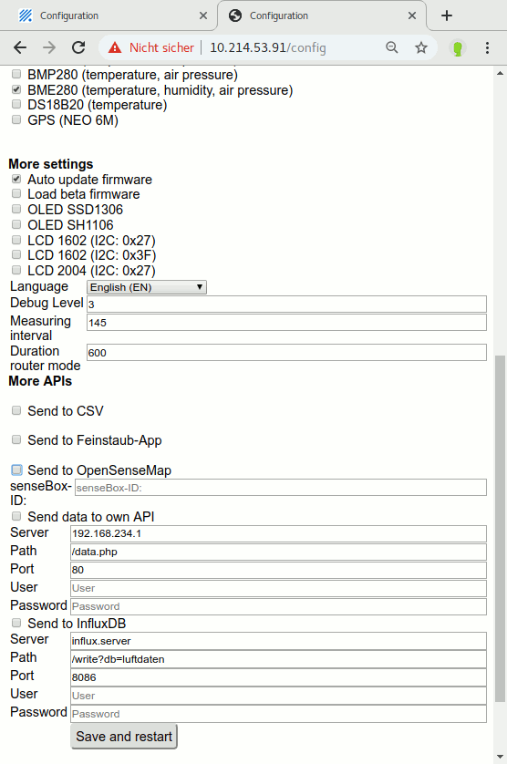{width=24%}

### Registrieren des Sensors via meine.luftdaten.info

Unter [meine.luftdaten.info](https://meine.luftdaten.info/) können Sensoren durch die Benutzer selbst eingetragen werden. Damit der Sensor Teil des Netzwerkes wird, brauchen wir noch einige Angaben.  
Registriere dich, falls noch nicht geschehen, und logge dich ein, dann füge einen Sensor hinzu und fülle das Formular aus.

* deine ID des ESP8266 (NodeMCU) –> kommt als Nummer im WLAN (Feinstaubsensor-…) oder auf der Konfigurationsseite oben
* deine Emailadresse (wird nicht veröffentlicht)
* deine Adresse: Strasse mit Hausnummer, PLZ und Ort und die Standortkoordinaten (werden nur gerundet herausgegeben)
* die Umgebung der Station – z. B. Höhe über Grund, Strassenseite, hohes Verkehrsaufkommen, freies Feld oder ähnliches

* Startseite -> (Login) - Sensoren -> Sensor registrieren

    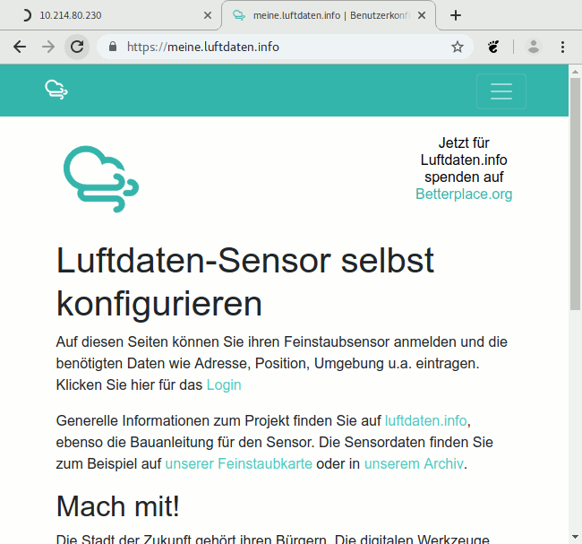{width=30%}
    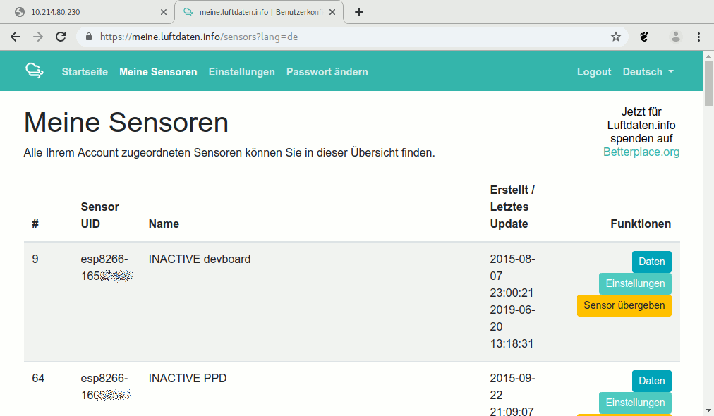{width=30%}
    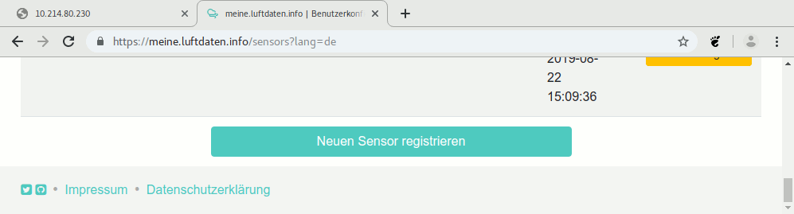{width=30%}
* Grundeinstellungen, Weitere Angaben

    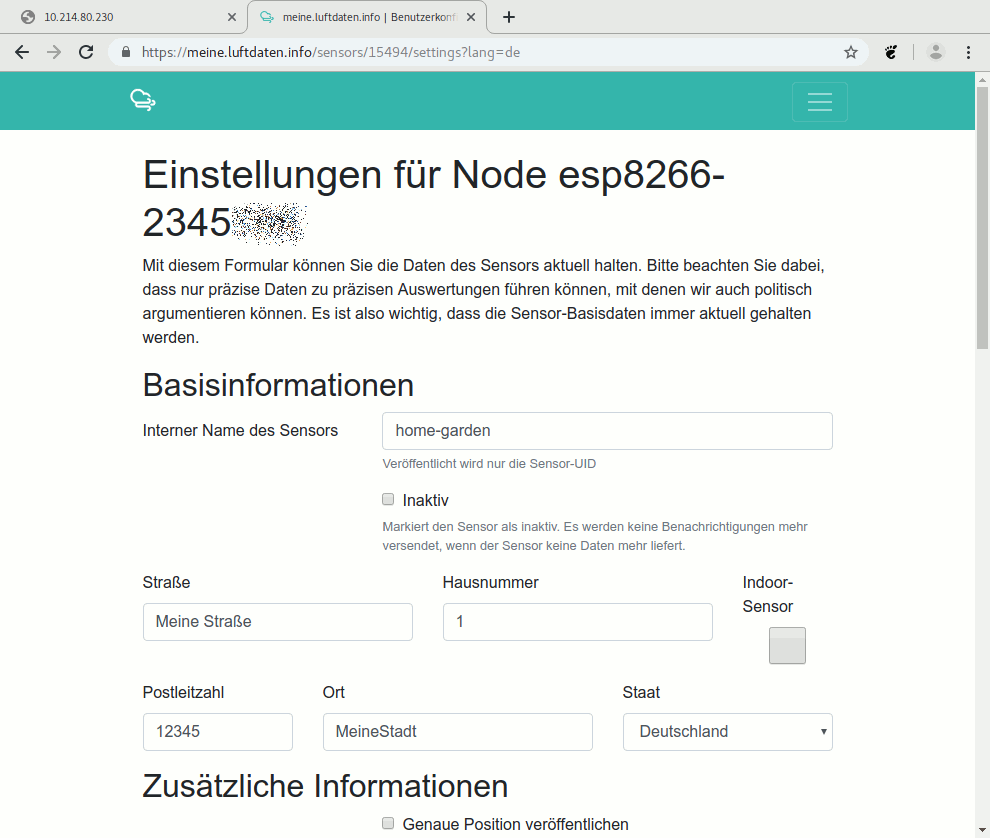{width=30%}
    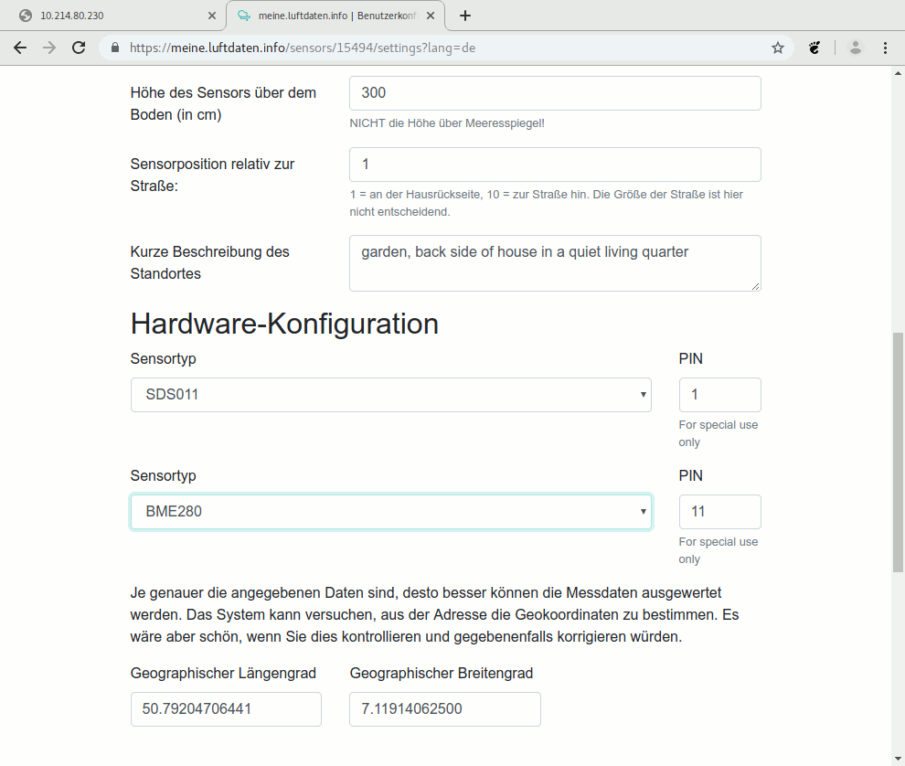{width=30%}
    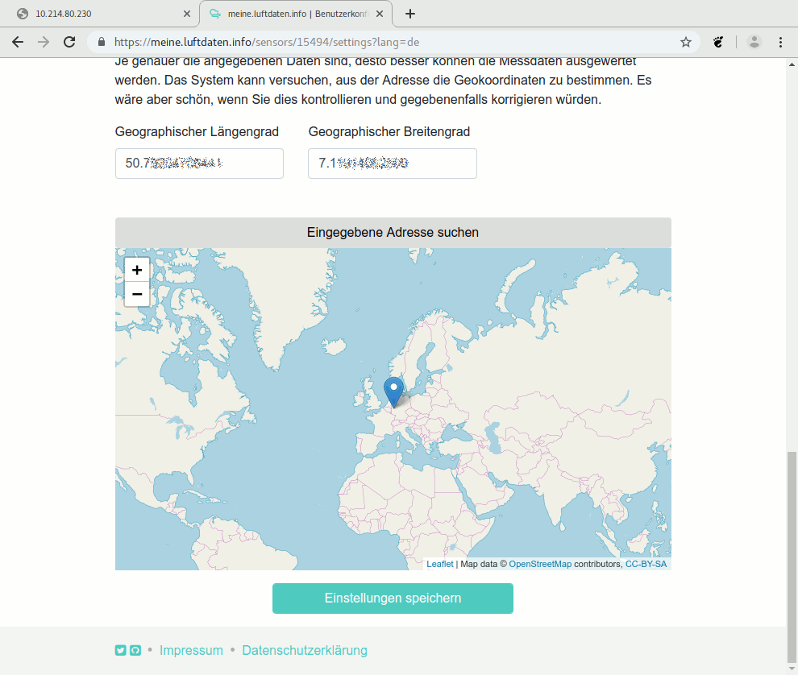{width=30%}

* (c) NodeMCU drawing by [roman-minyaylov](https://github.com/roman-minyaylov/nodemcu-v3-fritzing), MIT License
